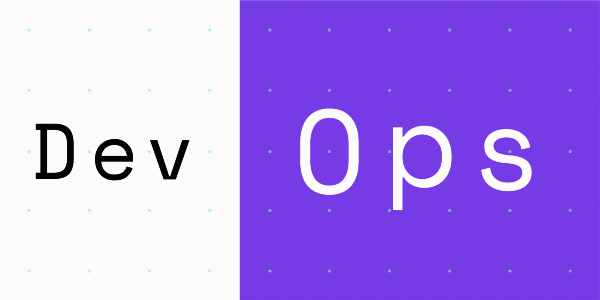

# Exadel DevOps Internship 🤘

[Exadel](https://exadel.com/)

---

# Tasks

|   №   |                    🔥 Task                    |  👀 Status   |     🚩 Result      |
| :---: | :------------------------------------------: | :---------: | :---------------: |
|   1   |      [Git & Github](./Task1/README.md)       |   `Done`    | `Pass with extra` |
|   2   |      [Clouds: Azure](./Task2/README.md)      |   `Done`    | `Pass with extra` |
|   3   |   [Terraform with AWS](./Task3/README.md)    |   `Done`    | `Pass with extra` |
|   4   | [Docker & Docker compose](./Task4/README.md) |   `Done`    | `Pass with extra` |
|   5   |         [Ansible](./Task5/README.md)         |   `Done`    | `Pass with extra` |
|   6   |                                              |             |                   |
|   7   |                                              |             |                   |
|   8   |                                              |             |                   |
