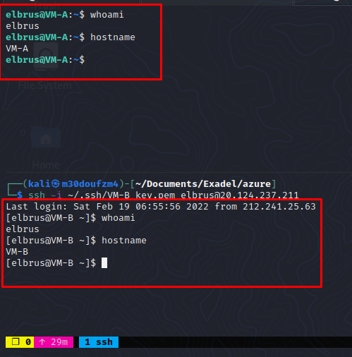

# exadel_practices
Internship labs

### Task 2. Azure
Author: Elbrus 

---

#### Step 1. Sign up 

Sign up for Microsoft Azure, familiarize yourself with the basic elements of the Azure console GUI.

- `Done`


#### Step 2. Billing 

PAY ATTENTION! Azure Billing and current costs and Azure services what you use.

- `Done`

#### Step 3. Creating 2 VMs 

Create two VM Instances with different operating systems (Linux / Ubuntu / ...). 
Try to stop them, restart, delete, recreate.


#### Step 4. SSH 

Make sure there is an SSH connection from your host to the created VM. What VM IP used for it?
IPs:

- `40.114.64.95` - VM-A
- `20.124.237.211` - VM-B



#### Step 5. Pings 

**Make sure ping and SSH are allowed from one VM to another in both ways.**

- `Done`


**Configure SSH connectivity between VMs using SSH keys.**

- `Done`


#### Step 6. Nginx and PHP

**Install web server (nginx/apache) to one instance.**
1. Updating repos

```bash 
sudo apt update
```


2. Installing nginx packets


```bash
sudo apt install nginx
```

3. Check status of nginx 

```bash
sudo systemctl status nginx
```


4. Chech with curl

```bash
curl http://localhost
```

5. Adding nginx into autoruns 

```bash
sudo systemctl enable nginx
```


**Create a web page with the text “Hello World”**

1. Changing default `/var/www/html/index.html` file

```bash
sudo vim /var/www/html/index.html
```

2. Delete all default text and insert `Hello World!`

**Add additional information: about OS version, free disk space, free/used memory in the system and about all running processes.**

1. Installing PHP

```bash
sudo apt install php
```

2. getting version of PHP

```bash
php --version
```

3. Installing PHP7.4-FPM and Other Extensions

```bash 
sudo apt install php7.4-fpm php7.4-cli php7.4-mysql php7.4-curl php7.4-json -y
```

4. Starting and add service into autoruns

```bash
systemctl start php7.4-fpm
systemctl enable php7.4-fpm
```

5. Configure Nginx to Process PHP Files. Changing settings in the `/etc/nginx/sites-available/default` file

```bash
sudo vim /etc/nginx/sites-available/default
```

Adding new lines:

```
server {
        listen 80;
        root /var/www/html;
        index index.php;

    location ~ \.php$ {
        include snippets/fastcgi-php.conf;
        fastcgi_pass unix:/run/php/php7.4-fpm.sock;
    }
}
```

6. Check cofigurations

```bash
sudo nginx -t
```
Screenshoot 

7. Change file ext 

```bash
sudo mv /var/www/html/index.html /var/www/html/index.php
```

8. Open index file and add php code to get OS Version

```php
...

<h2>OS Version</h2>
<?php
$os = shell_exec("uname -a");
echo $os;
?>

...
```
9. Get free disk spacke

```php
...

<h2>Free disk space</h2>
<?php
$free = shell_exec("df -k / | tail -1 | awk '{print $4}'");
echo "<p>Free disk space is $free</p>";
?>

...
```

10. Get free and used mem

```php
...
                                                                                                                     
<h2>Memory</h2>
<?php
$free_mem = shell_exec("free -m | awk '/^Mem/ {print $4}'");                                                       
$used_mem = shell_exec("free -m | awk '/^Mem/ {print $3}'");                                 
echo "<p>Used mem is $used_mem</p>";                                                          
echo "<p>Free mem is $free_mem</p>";                                                                    
?>

...
```

11. Get running processes

```php
<h2>Running processes</h2>
<table width="900px" border="1">
    <?php
    exec("ps aux", $psOutput);
    if (count($psOutput) > 0) {
        foreach ($psOutput as $ps) {
            $ps = preg_split('/ +/', $ps);
            $pid = $ps[1];
            $cpu = $ps[2];
            $mem = $ps[3];
            $time = $ps[8];
            $command = $ps[10] . " " . $ps[11];
            echo "<tr>";
              echo "<td>" . $pid . "</td>";
              echo "<td>" . $cpu . "</td>";
              echo "<td>" . $mem . "</td>";
              echo "<td>" . $time . "</td>";
              echo "<td>" . $command . "</td>";
            echo "</tr>";
        }
    }
    ?>
```

**Make sure your web server is accessible from the internet and you can see your web page in your browser**


**Make sure on the instance without nginx/apache you also maysee the content of your webpage from instance with nginx/apache.**


---


### EXTRA (optional) 

#### Step 1. New VMs!

**Run steps 3-6 with VMs created in different Virtual Networks. (connectivity must be both external and internal IP).**


#### Step 2. Bash!

**Write BASH script for installing web server (nginx/apache) and creating web pages with text “Hello World”, and information about OS version** 

- [Bash script](ngi.sh)


### EXTRA (optional) 

1. Make a screenshot only of your web page сontent from your browser.
2. Create your Storage Account and place your screenshot there.
3. Make your screenshot visible (public) on the internet for everyone and make sure it works.

- https://internex.blob.core.windows.net/screenshoots/img13.png
- https://internex.blob.core.windows.net/screenshoots/img17.png
