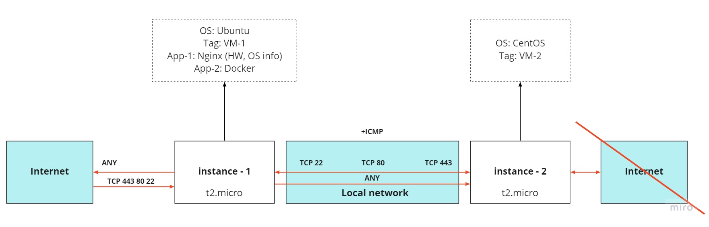

# exadel_practices
Internship labs

### Task 3. Terraform / IaC
Author: Elbrus 

--- 

#### Important moments

| № 	| Task 	| Answer 	|
|:---:	|:---:	|:---:	|
| 1 	| Read about IaC 	| - https://www.youtube.com/watch?v=SLB_c_ayRMo - https://learn.hashicorp.com/collections/ - https://learn.hashicorp.com/tutorials/terraform/infrastructure-as-code - https://registry.terraform.io/providers/hashicorp/aws/latest/docs 	|
| 2 	| All steps are done using Terraform 	| Done 	|
| 3 	| You should not use the previously created VPC/EC2 	| Done 	|
| 4 	| Passwords/Keys should not be stored on GitHub 	| Done 	|

 
#### Tasks
1. Create EC2 Instance t2.micro: Ubuntu, CentOS
2. Both instances must have a tag with names. 
3. EC2 Ubuntu must have Internet access, there must be incoming access: ICMP, TCP/22, 80, 443, and any outgoing access. 
4. EC2 CentOS should not have access to the Internet, but must have outgoing and incoming access: ICMP, TCP/22, TCP/80, TCP/443 only on the local network where EC2 Ubuntu, EC2 CentOS is located. 
5. On EC2 Ubuntu, install a web server (nginx/apache);
   - Create a web page with the text “Hello World” and information about the current version of the operating system. This page must be visible from the Internet. 
6. On EC2 Ubuntu install Docker, installation should be done according to the recommendation of the official Docker manuals 

---

#### Scheme

#### Practice

- [Main terraform config](./main.tf)
- [Variables types](./variables.tf)
- [Values of variables](./terraform.tfstate)
- [Terraform plan output]()
 
---

#### EXTRA
1. Complete  step 1, but AMI ID cannot be hardcoded. You can hardcode operation system name, version, etc. 
2. Step 3 read as: 
   - EC2 CentOS should have outgoing and incoming access: ICMP, TCP/22, TCP/80, TCP/443, only to EC2 Ubuntu. 
3. On EC2 CentOS install nginx (note. Remember about step 7, the task can be done in any way, it is not necessary to use terraform)
4. - Create a web page with the text “Hello World”. This page must be visible from the  EC2 Ubuntu.
 
The result of steps.1-7. is a terraform files in your GitHub. +file with output terraform plan BEFORE creating infrastructure.
The result of step EXTRA 8, is or scripts (if you have one), or an explanation of how this can be implemented.

#### Useful terraform commands

- `terraform init` - 
- `terraform plan` -
- `terraform apply` - 
- `terraform destroy` -  