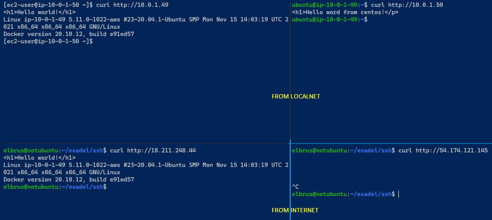

# exadel_practices
Internship labs

### Task 3. Terraform / IaC
Author: Elbrus 

--- 

#### Important moments

| № 	| Task 	| Answer 	|
|:---:	|:---:	|:---:	|
| 1 	| Read about IaC 	| - https://www.youtube.com/watch?v=SLB_c_ayRMo - https://learn.hashicorp.com/collections/ - https://learn.hashicorp.com/tutorials/terraform/infrastructure-as-code - https://registry.terraform.io/providers/hashicorp/aws/latest/docs 	|
| 2 	| All steps are done using Terraform 	| Done 	|
| 3 	| You should not use the previously created VPC/EC2 	| Done 	|
| 4 	| Passwords/Keys should not be stored on GitHub 	| Done 	|

 
#### Tasks
1. Create EC2 Instance t2.micro: Ubuntu, CentOS
2. Both instances must have a tag with names. 
3. EC2 Ubuntu must have Internet access, there must be incoming access: ICMP, TCP/22, 80, 443, and any outgoing access. 
4. EC2 CentOS should not have access to the Internet, but must have outgoing and incoming access: ICMP, TCP/22, TCP/80, TCP/443 only on the local network where EC2 Ubuntu, EC2 CentOS is located. 
5. On EC2 Ubuntu, install a web server (nginx/apache);
   - Create a web page with the text “Hello World” and information about the current version of the operating system. This page must be visible from the Internet. 
6. On EC2 Ubuntu install Docker, installation should be done according to the recommendation of the official Docker manuals 

---

#### Scheme

#### Mandatory practice

- [Main terraform config](./main.tf)
- AWS instances:
  - [AWS Ubuntu](./aws_instance/aws_instance_ubuntu.tf)
  - [AWS Centos](./aws_instance/aws_instance_centos.tf)
- AWS Network:
  - EIP:
    - [AWS EIP Ubuntu](./aws_eip/aws_eip_ubuntu.tf)
    - [AWS EIP Centos](./aws_eip/aws_eip_centos.tf)
  - Network interface:
    - [AWS Ubuntu NIC](./network/aws_nic/aws_network_interface_ubuntu.tf)
    - [AWS Centos NIC](./network/aws_nic/aws_network_interface_centos.tf)
  - [AWS Internet GW](./network/aws_internet_gw.tf)
  - [AWS Route Table](./network/aws_route_table.tf)
  - [AWS Route Table Association](./network/aws_route_table_association.tf)
- AWS Security Groups:
  - [AWS Security Group for Ubuntu](./aws_security_group/aws_security_group_ubuntu.tf)
  - [AWS Security Group for Centos](./aws_security_group/aws_security_group_centos.tf)
- [Variables types](./variables.tf)
- [Values of variables](./terraform.tfvars)
- [Terraform mandatory plan output](./output/mandatory_task_output.txt)
 

---

#### EXTRA
1. Complete  step 1, but AMI ID cannot be hardcoded. You can hardcode operation system name, version, etc. 
2. Step 3 read as: 
   - EC2 CentOS should have outgoing and incoming access: ICMP, TCP/22, TCP/80, TCP/443, only to EC2 Ubuntu. 
3. On EC2 CentOS install nginx (note. Remember about step 7, the task can be done in any way, it is not necessary to use terraform)
4. - Create a web page with the text “Hello World”. This page must be visible from the  EC2 Ubuntu.
 
The result of steps.1-7. is a terraform files in your GitHub. +file with output terraform plan BEFORE creating infrastructure.
The result of step EXTRA 8, is or scripts (if you have one), or an explanation of how this can be implemented.

#### Extra practice 

- AMI ID inserted with terraform variables [tf variables](./variables.tf)
- Changed security group rules of centos machine to `allow` access to the internet (`egress` not `ingress`)
- Knowing that ubuntu has access to internet, we can build ssh proxy. 
- Connecting to ubuntu machine and install simle http(s) proxy tinyproxy
- Tinyproxy should listening the 443 port
- After configuring the http proxy, we should connect to the centos form ubuntu
- Next, building ssh tunnel from centos 443 port to ubuntu 443 port
  - `ssh -i ubuntu-ssh.pem -N -L 443:localhost:443 ubuntu@10.0.1.49`  
- Now we should setup proxy environment variables on centos
  - `export http_proxy=http://localhost:443`
  - `export https_proxy=http://localhost:443`
  - init proxy at `yum.conf` file
    - `proxy=http://localhost:443`
  - Let's update repos and install nginx with `yum`
    - `sudo yum -y update`
    - `sudo yum install -y https://dl.fedoraproject.org/pub/epel/epel-release-latest-7.noarch.rpm`
    - `sudo yum install -y epel-release`
    - `sudo yum update -y`
    - `sudo yum install nginx -y`
  - Adding needed info:
    - `echo '<h1>Hello world from centos!</h1>' | sudo tee /usr/share/nginx/html/index.html`
    - `sudo systemctl start nginx`
    - `sudo systemctl enable nginx` 
- Curling both machines:

---

#### Useful terraform commands

- `terraform init` - is used to initialize a working directory containing Terraform configuration files.
- `terraform plan` - command creates an execution plan, which lets you preview the changes that Terraform plans to make to your infrastructure.
- `terraform apply` - command executes the actions proposed in a Terraform plan.
- `terraform destroy` -  command is a convenient way to destroy all remote objects managed by a particular Terraform configuration.