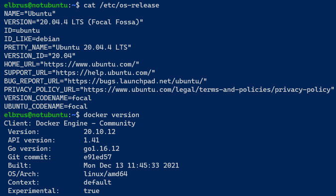

# Exadel DevOps Internship 🤘

---

## Mandatory

Install docker on VM - `Ubuntu 20.04 LTS`

- `chmod +x ubuntu-docker-install.sh`
- `sudo ./ubuntu-docker-install.sh`

**Result: **

## EXTRA 

Write bash script for installing Docker. 

- [Custom docker installing sh script](../scripts/ubuntu-docker-install.sh)
- [Official docker installing sh script](../scripts/official-docker-install.sh)

## Resources

- https://docs.docker.com/engine/install/ubuntu/
- https://github.com/docker/docker-install
- https://docs.docker.com/engine/install/ubuntu/#install-using-the-convenience-script
 