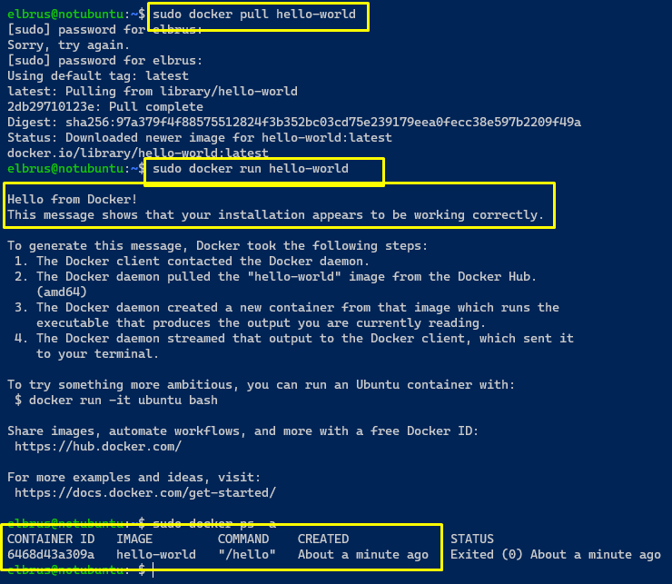
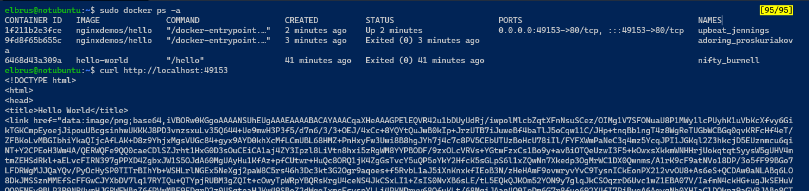
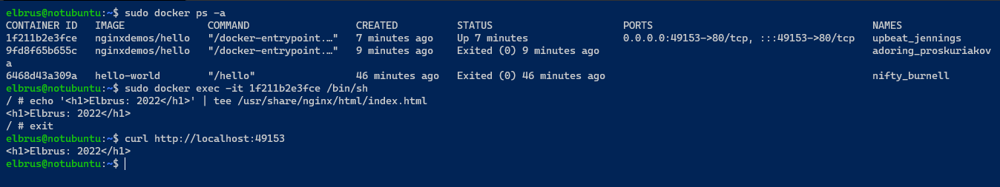

# Exadel DevOps Internship 🤘

---

## Mandatory

### Find, download & run docker container

In this case used [Official "Hello world" container from Dockerhub](https://hub.docker.com/_/hello-world)

### Commands & parameters

### Containers

#### Lifecycle

- `docker create` creates a container but does not start it.
- `docker rename` allows the container to be renamed.
- `docker run` creates and starts a container in one operation.
- `docker rm` deletes a container.
- `docker update` updates a container's resource limits.

#### Starting and Stopping

- `docker start` starts a container so it is running.
- `docker stop` stops a running container.
- `docker restart` stops and starts a container.
- `docker pause` pauses a running container, "freezing" it in place.
- `docker unpause` will unpause a running container.
- `docker wait` blocks until running container stops.
- `docker kill` sends a SIGKILL to a running container.
- `docker attach` will connect to a running container.

#### Info

- `docker ps` shows running containers.
- `docker logs` gets logs from container.
- `docker inspect` looks at all the info on a container (including IP address).
- `docker events` gets events from container.
- `docker port` shows public facing port of container.
- `docker top` shows running processes in container.
- `docker stats` shows containers' resource usage statistics.
- `docker diff` shows changed files in the container's FS.

#### Import/Export

- `docker cp` copies files or folders between a container and the local filesystem.
- `docker export` turns container filesystem into tarball archive stream to STDOUT.

#### Executing Commands

- `docker exec` to execute a command in container. Use: `docker exec -it foo /bin/bash`

### Images

#### Lifecycle

- `docker images` shows all images.
- `docker import` creates an image from a tarball.
- `docker build` creates image from Dockerfile.
- `docker commit` creates image from a container, pausing it temporarily if it is running.
- `docker rmi` removes an image.
- `docker load` loads an image from a tar archive as STDIN
- `docker save` saves an image to a tar archive stream to STDOUT with all parent layers

#### Info

- `docker history shows history of image.
- `docker tag tags an image to a name (local or registry).

#### Load/Save

Load an image from file:

- `docker load < my_image.tar.gz`

Save an existing image:

- `docker save my_image:my_tag | gzip > my_image.tar.gz`

#### Import/Export container

Import a container as an image from file:

- `cat my_container.tar.gz | docker import - my_image:my_tag`
  
#### Export an existing container:

- `docker export my_container | gzip > my_container.tar.gz`

#### Resources for additional information 

Commands:

- https://github.com/drminnaar/cheatsheets/blob/master/docker-cheatsheet.md
- https://github.com/eon01/DockerCheatSheet
- https://github.com/WSMathias/docker-cheat-sheet
- https://github.com/wsargent/docker-cheat-sheet

Best practice:

- https://docs.docker.com/get-started/09_image_best/
- https://docs.docker.com/develop/develop-images/dockerfile_best-practices/
- https://docs.docker.com/engine/security/
- https://blog.gitguardian.com/how-to-improve-your-docker-containers-security-cheat-sheet/

Security

- https://vulners.com/search?query=docker
- https://blog.gitguardian.com/how-to-improve-your-docker-containers-security-cheat-sheet/
- https://github.com/Swordfish-Security/Pentest-In-Docker

#### EXTRA 

Use image with html page, edit html page and paste text: `Username 2022`

- `docker pull nginxdemos/hello`
- `docker run -P -d nginxdemos/hello`
- `docker ps -a`

- `docker exec -it 1f211b2e3fce /bin/sh`
- `echo '<h1>Elbrus: 2022</h1>' | tee /usr/share/nginx/html/index.html`

