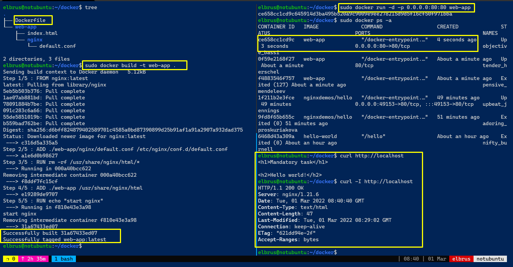
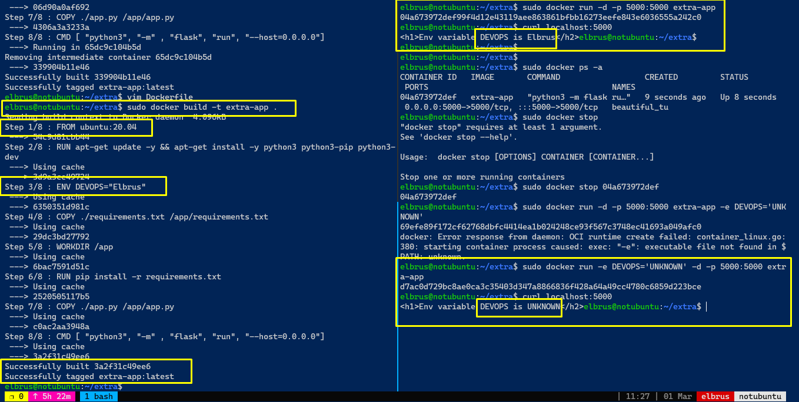

# Exadel DevOps Internship 🤘

---

## Mandatory

1. Create your Dockerfile for building a docker image. 
2. Your docker image should run any web application (nginx, apache, httpd). 
3. Web application should be located inside the docker image.

👉 [Mandatory - Dockerfile](../docker/mandatory/Dockerfile)

## EXTRA

1. For creating docker image use clear basic images (ubuntu, centos, alpine, etc.)
2. Add an environment variable `DEVOPS=<username>` to your docker image 
3. Print environment variable with the value on a web page 

(if environment variable changed after container restart - the web page must be updated with a new value)

👉 [Extra - Dockerfile](../docker/extra/Dockerfile)