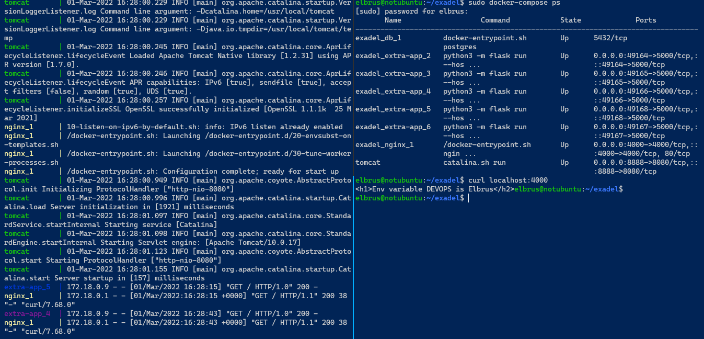

# Exadel DevOps Internship 🤘

---

## Mandatory

1. Create docker-compose file. 
2. Deploy a few docker containers via one docker-compose file. 
    2.1. First image - your docker image from the previous step. 5 nodes of the first image should be run
    2.2. Second image - any java application
    2.3. Last image - any database image (mysql, postgresql, mongo or etc.).
3. Second container should be run right after a successful run of a database container.


👉 [Checkout mandatory docker-compose file!](../docker/docker-compose/mandatory/docker-compose.yml)


## EXTRA 

Use env files to configure each service.



👉 [Checkout extra docker-compose file!](../docker/docker-compose/extra/docker-compose.yml)

DOTENV file:

```env
POSTGRES_DB=extra-db
POSTGRES_USER=postgres
POSTGRES_PASSWORD=postgres
```

