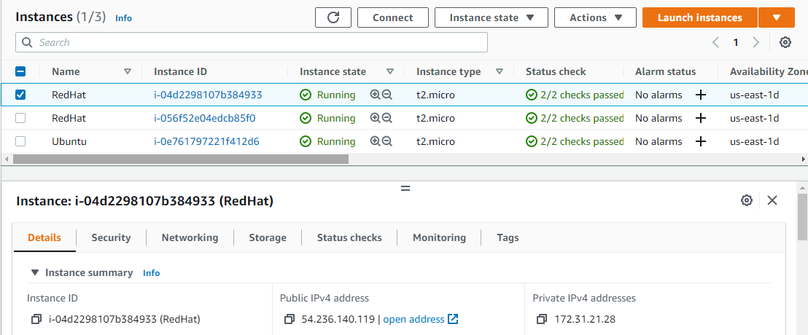
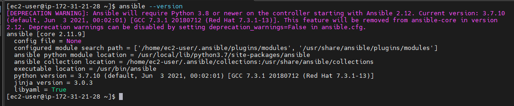
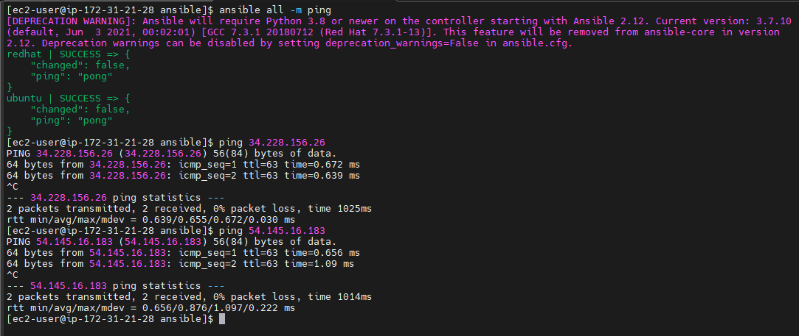
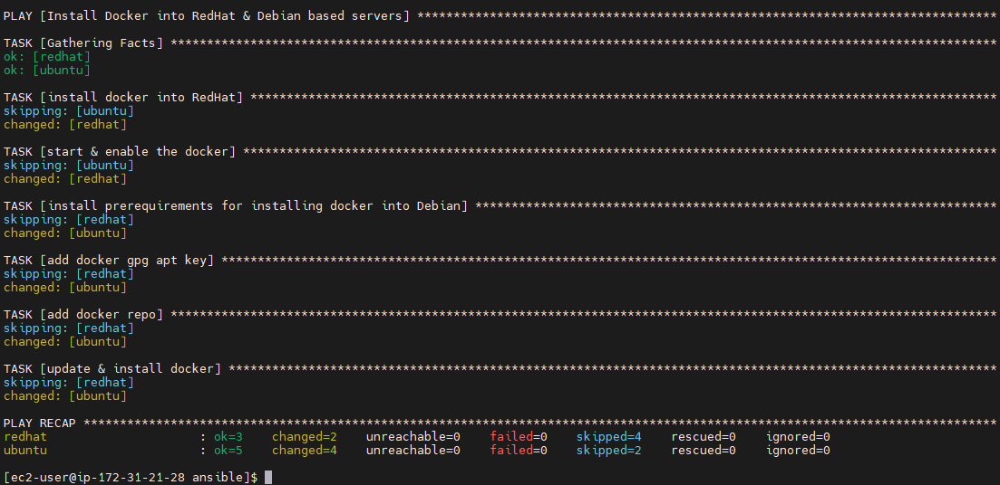
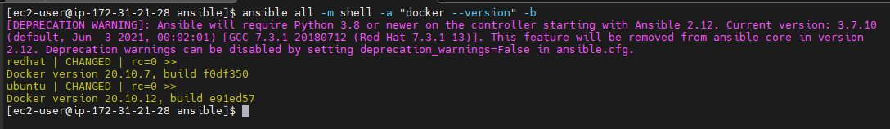
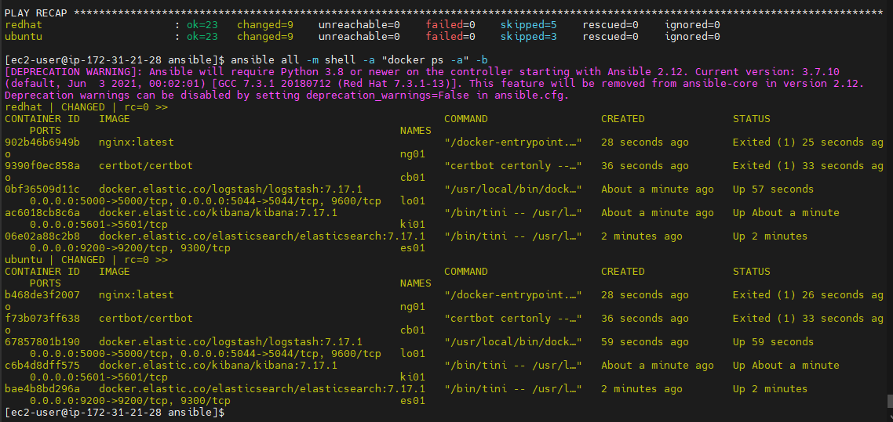
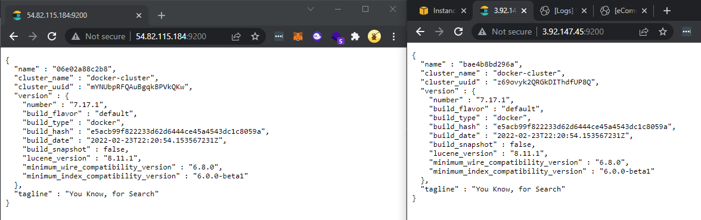
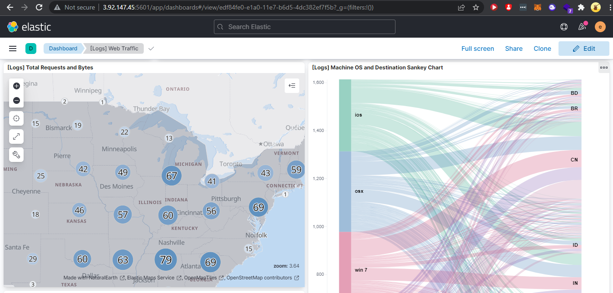
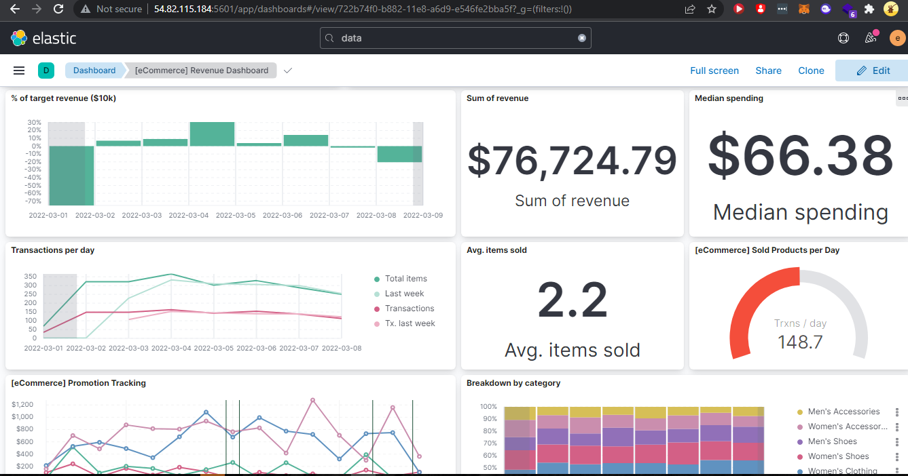

# Exadel DevOps Internship 🤘

---

## Important points
 
1. Read documentation about System configuration management.
2. Learn about the advantages and disadvantages of Ansible over other tools.
3. Become familiar with ansible basics and YAML syntax.
4. Basics of working with Ansible from the official documentation
5. Read the Jinja2 templates documentation
 
## Mandatory
1. Deploy three virtual machines in the Cloud. 

2. Install Ansible on one of them (control_plane).

3. Ping pong - execute the built-in ansible ping command & 4. Ping the other two machines.

4. My First Playbook: write a playbook for installing Docker on two machines and run it.



👉 [Checkout my first ansible playbook!](./ansible-playbooks/mandatory/ansible-docker-install.yml)

## EXTRA 

1. Write a playbook for installing Docker and ELK in Docker.
2. Playbooks should not have default creds to databases and/or admin panel.
3. For the execution of playbooks, dynamic inventory must be used (GALAXY can be used).

👉 [Checkout my another ansible playbook!](./ansible-playbooks/extra/elk-playbook.yml)

### Steps

0. Setup usernames & passwords into vars folder

```sh
ansible-vault encrypt_string
```

Added the values into vars file - [all](./ansible-playbooks/extra/inventory/group_vars/all)

1. Execute the ansible playbook:

```sh
ansible-playbook elk-playbook.yml --ask-vault-pass
```




2. After executing necessary to setup new passwords on target servers

```sh
ansible all -m shell -a 'docker exec -it {{ elasticsearch_hostname }} /bin/bash -c "elasticsearch-setup-passwords auto"' -b
```

3. Save the passwords & go the admin panels 

--- 

### Another way to change passwords

Go to the target servers, run this command: 

```sh
docker exec -it es01 /bin/bash
```

than try to do POST req: 

```sh
curl -X POST "localhost:9200/_security/user/kibana/_password?pretty" -H 'Content-Type: application/json' -d'
> {
>   "password" : "<YOUR-NEW-PASSWORD>"
> }
> ' -u kibana:<YOUR-OLD-PASSWORD>

{ }
```
and 

```sh
curl -X POST "localhost:9200/_security/user/elastic/_password?pretty" -H 'Content-Type: application/json' -d'
{
  "password" : "<YOUR-NEW-PASSWORD>"
}
' -u elastic:<YOUR-OLD-PASSWORD>

{ }
```

Restart docker containers

```sh
sudo docker restart $(sudo docker ps -q)
```

### OR 

in the playbook we can add task session to automatically do POST req:

```
- name: Update password via ES API
  uri:
    url: http://{{ elasticsearch_hostname }}:9200/_xpack/security/user/{{elastic_username}}/_password
    method: POST
    body_format: json
    body: "{ \"password\":\"{{ elastic_new_password }}\" }"
    status_code: 200
    user: "{{elastic_username}}"
    password: "{{elastic_password}}"
    force_basic_auth: yes

```

### Using GALAXY 

1. Download files from Ansible-galaxy  
   
```sh
ansible-galaxy install lucasmaurice.elk
```

2. Move role files into ansible project directory 

```sh
mv ~/.ansible/roles/lucasmaurice.elk ./roles
```

3. Content of playbook 

```sh
less elk-playbook.yml

---
- hosts: elk-machines
  become: true
  roles:
    - { role: docker, tags: ["docker"] }
    - { role: lucasmaurice.elk, tags: ["lucasmaurice.elk"] }
```

4. Executing the playbook 

```sh
ansible-playbook elk-playbook.yml 
```

--- 

### Results




