# Exadel DevOps Internship 🤘

---

## Important points

1. Read about Jenkins. 
2. What is Jenkins and what is it used for? Ways of using. 
3. What is a declarative and imperative approach? 
 
## Mandatory tasks

1. Install Jenkins. It must be installed in a docker container.

```sh
# installing jenkins docker container
sudo docker pull jenkins/jenkins

# make dir for jenkins configurations files
mkdir jenkins_home

# getting configuration files
sudo docker run -d -v jenkins_home:/var/jenkins_home -p 8080:8080 -p 50000:50000 jenkins/jenkins

# show admin password for auth in web panel
less jenkins_home/secrets/initAdminKey
```
2. Install necessary plugins (if you need).

- `Installed community/recommended plugins` 


3. Configure several (2-3) build agents. Agents must be run in docker.

- `Installed docker pipeline plugin`

4. Create a Freestyle project. Which will show the current date as a result of execution.


5. Create Pipeline which will execute `docker ps -a` in docker agent, running on Jenkins master’s Host.

```sh
# Run Jenkins 
 sudo docker run -p 8080:8080 -p 50000:50000 -d -v /var/run/docker.sock:/var/run/docker.sock -v jenkins_home:/var/jenkins_home jenkins/jenkins

# Execute thw bash with root user
docker exec -it --user root <container id> /bin/bash

# Download docker in jenkins docker container
curl https://get.docker.com/ > dockerinstall && chmod 777 dockerinstall && ./dockerinstall
```

Result:


Setup pipeline in Jenkins:

```
pipeline {
  agent {
    docker { 
        image 'ubuntu' 
        args '-u root:sudo'
    }
  }
  stages {
    stage('Install Docker') {
      steps {
        sh '''
           apt update -y
           apt install curl -y
           curl https://get.docker.com/ > dockerinstall && chmod 777 dockerinstall && ./dockerinstall
           docker ps -a
        '''
      }
    }
  }
}
```

Result:


6. Create Pipeline, which will build artifact using Dockerfile directly from your github repo (use Dockerfile from previous task).

```
pipeline {
    agent { 
        dockerfile {
            filename './Task4/docker/extra/Dockerfile'
            args '-u root:sudo'
        } 
        
    }
    stages {
        stage('Update repo list') {
            steps {
                sh 'apt update -y'
            }
        }
        stage('Test') {
            steps {
                sh 'python3 --version'
            }
        }
    }
}
```

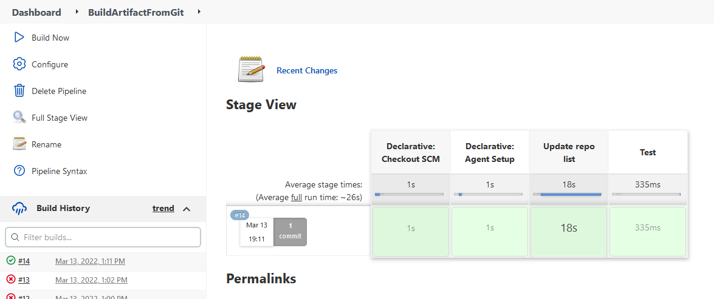


7. Pass  variable PASSWORD=QWERTY! To the docker container. Variable must be encrypted!!!

```
pipeline {
    agent { 
        dockerfile {
            filename './Task4/docker/extra/Dockerfile'
            args '-u root:sudo'
        } 
    }
    environment {
        PASSWORD = credentials('JENKINS-SECRET-TEXT')
    }
    stages {
        stage('Update repo list') {
            steps {
                sh 'apt update -y'
            }
        }
        stage('Test') {
            steps {
                sh 'python3 --version'
                sh 'echo ${PASSWORD}'
            }
        }
    }
}
```

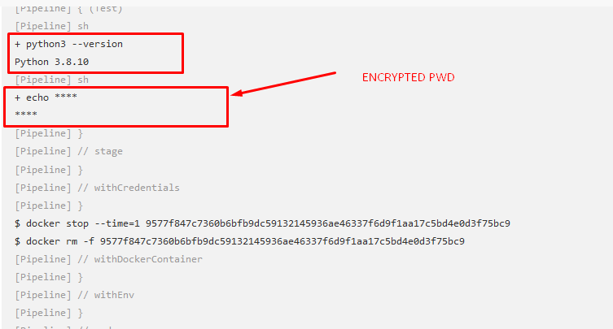
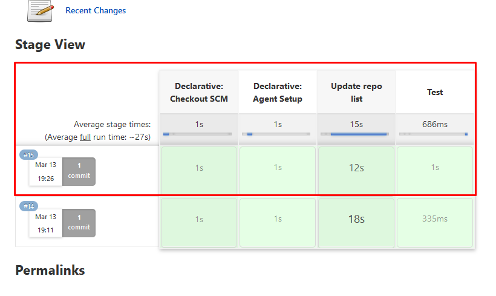

👉 [Jenkins pipeline](./Jenkinsfile)

## EXTRA

1. Create a pipeline, which will run a docker container from Dockerfile at the additional VM.

👉 [Checkout Jenkinsfile](../Task4/docker/extra/Jenkinsfile)

2. Create an ansible playbook, which will deploy Jenkins.

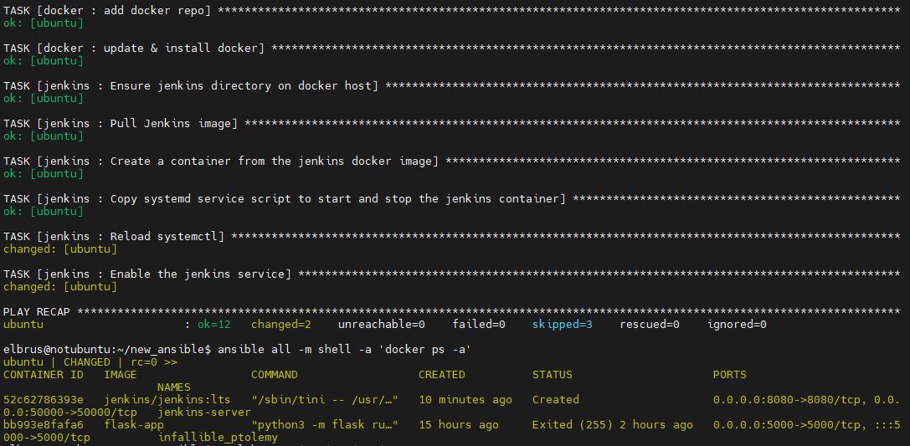
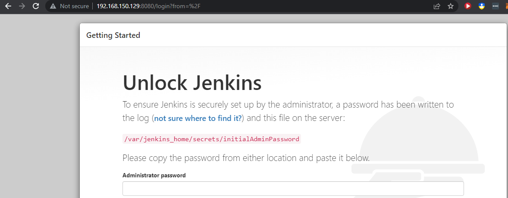

👉 [Ansible playbook](./ansible-playbook/jenkins-playbook.yml)

3. Deploy a local docker registry, upload a docker image there, download img from your local docker registry and run the container.

```sh
# Run a local registry
docker run -d -p 5000:5000 --restart=always --name registry registry:2

# Working dir 
tree
.
├── app.py
├── Dockerfile
└── requirements.txt

# Build image with dockerfile
docker build --tag localhost:5000/flask-web .

# Push image to local docker registry 
docker push localhost:5000/flask-web
```

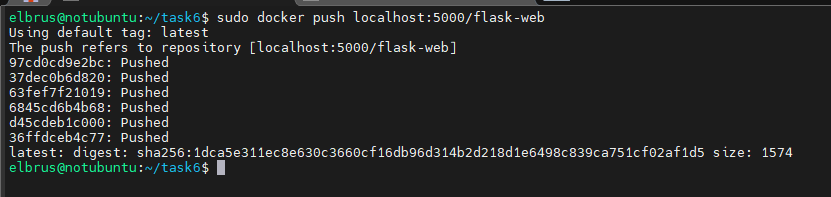

```sh
# Download image from local registry
docker pull localhost:5000/flask-web

# Run container 
sudo docker run -p 3001:5000 -d flask-web
```

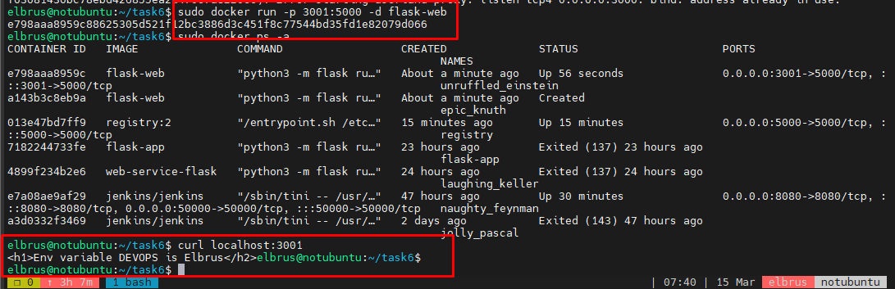

4. Configure integration between Jenkins and your Git repo. Jenkins project must be started automatically if you push or merge to master, you also must see Jenkins last build status(success/unsuccess) in your Git repo.

`
NOTE: The budget does not work cause Jenkins installed locally!
Example of badge: 
[](https://c4cc-217-29-29-53.ngrok.io/job/Integration%20Jenkins%20with%20Github/)
`

## Integration with GitHub

1. Installing `ngrok`

```sh
wget https://bin.equinox.io/c/4VmDzA7iaHb/ngrok-stable-linux-amd64.tgz

tar xvf ngrok-stable-linux-amd64.tgz

mv ngrok /usr/local/bin

ngrok authtoken <Token>
```

2. Setup new Freestyle project

- Source Code Management
  - Git
    - url: `https://github.com/kh-elbrus/exadel_practices.git`
    - branch: `jenkins`
- Build Triggers
  - `GitHub hook trigger for GITScm polling`
- Build
  - Execute script
    - `echo test build`
    - `ls -la`
- Save

3. Setup GitHub WebHooks

```sh
# run ngrok and forward to the 8080 port 
ngrok http 0.0.0.0:8080
```

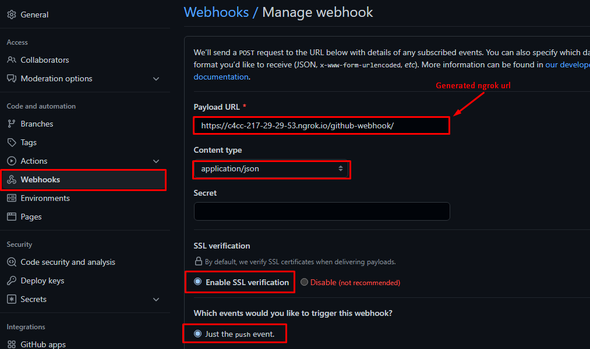

4. Triggering event

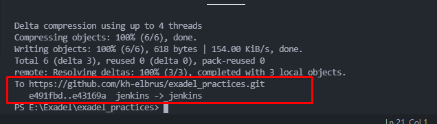
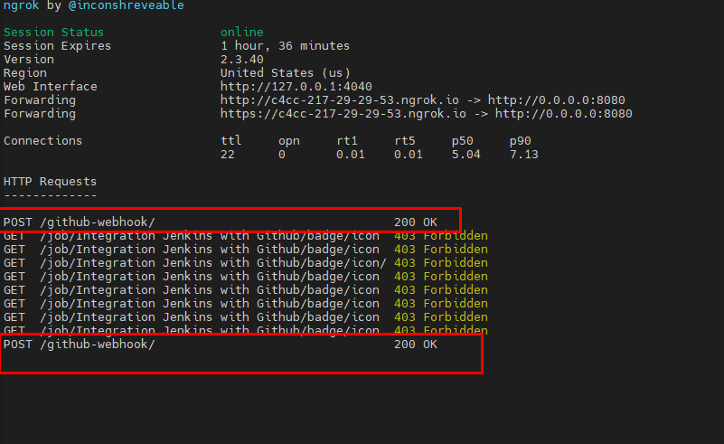
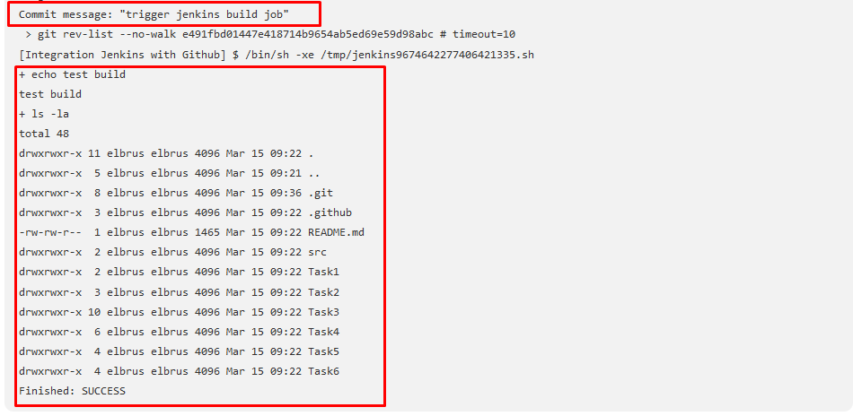

