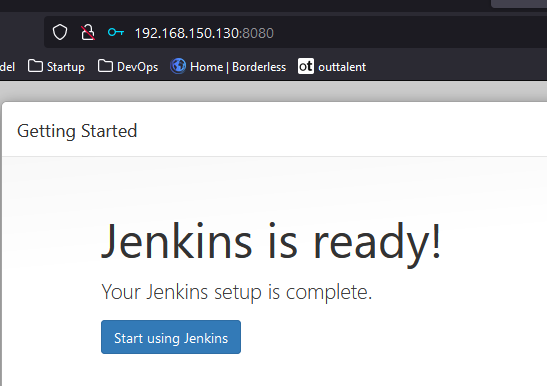
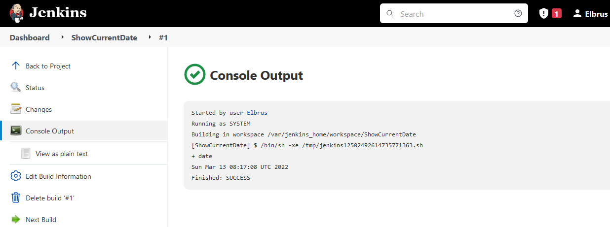
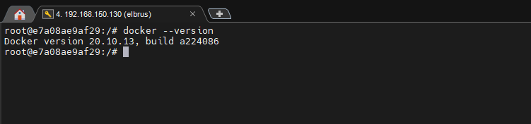
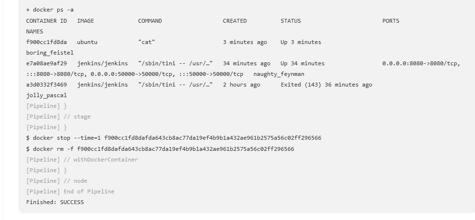
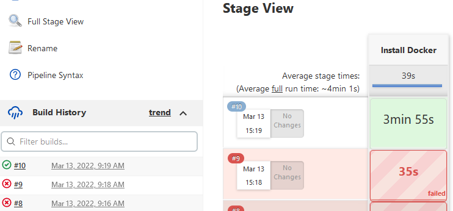

# Exadel DevOps Internship 🤘

---

## Important points

1. Read about Jenkins. 
2. What is Jenkins and what is it used for? Ways of using. 
3. What is a declarative and imperative approach? 
 
## Mandatory tasks

1. Install Jenkins. It must be installed in a docker container.

```sh
# installing jenkins docker container
sudo docker pull jenkins/jenkins

# make dir for jenkins configurations files
mkdir jenkins_home

# getting configuration files
sudo docker run -d -v jenkins_home:/var/jenkins_home -p 8080:8080 -p 50000:50000 jenkins/jenkins

# show admin password for auth in web panel
less jenkins_home/secrets/initAdminKey
```
2. Install necessary plugins (if you need).

- `Installed community/recommended plugins` 



3. Configure several (2-3) build agents. Agents must be run in docker.

- `Installed docker pipeline plugin`

4. Create a Freestyle project. Which will show the current date as a result of execution.



5. Create Pipeline which will execute `docker ps -a` in docker agent, running on Jenkins master’s Host.

```sh
# Run Jenkins 
 sudo docker run -p 8080:8080 -p 50000:50000 -d -v /var/run/docker.sock:/var/run/docker.sock -v jenkins_home:/var/jenkins_home jenkins/jenkins

# Execute thw bash with root user
docker exec -it --user root <container id> /bin/bash

# Download docker in jenkins docker container
curl https://get.docker.com/ > dockerinstall && chmod 777 dockerinstall && ./dockerinstall
```

Result:



Setup pipeline in Jenkins:

```yum
pipeline {
  agent {
    docker { 
        image 'ubuntu' 
        args '-u root:sudo'
    }
  }
  stages {
    stage('Install Docker') {
      steps {
        sh '''
           apt update -y
           apt install curl -y
           curl https://get.docker.com/ > dockerinstall && chmod 777 dockerinstall && ./dockerinstall
           docker ps -a
        '''
      }
    }
  }
}
```

Result:




6. Create Pipeline, which will build artifact using Dockerfile directly from your github repo (use Dockerfile from previous task).
7. Pass  variable PASSWORD=QWERTY! To the docker container. Variable must be encrypted!!!

 
## EXTRA

1. Create a pipeline, which will run a docker container from Dockerfile at the additional VM.
2. Create an ansible playbook, which will deploy Jenkins.
3. Deploy a local docker registry, upload a docker image there, download img from your local docker registry and run the container.
4. Configure integration between Jenkins and your Git repo. Jenkins project must be started automatically if you push or merge to master, you also must see Jenkins last build status(success/unsuccess) in your Git repo.

