# Exadel DevOps Internship 🤘

---


---

:: technologies:
  - `elasticsearch`
  - `kibana`
  - `logstash`
  - `opendistro`
  - `wazuh`
  - `filebeat`

## ELK

1. Install and configure ELK
2. Organize collection of logs from docker to ELK and receive data from running containers
3. Customize your dashboards in ELK
4. Configure monitoring in ELK, get metrics from your running containers
5. Study features and settings


### Install & Configure ELK with Wazuh & Filebeat 

#### Install ELK 

```sh
# ======= ELASTICSEARCH ======= #
$ wget -qO - https://artifacts.elastic.co/GPG-KEY-elasticsearch | sudo gpg --dearmor -o /usr/share/keyrings/elasticsearch-keyring.gpg

$ sudo apt-get install apt-transport-https

$ echo "deb [signed-by=/usr/share/keyrings/elasticsearch-keyring.gpg] https://artifacts.elastic.co/packages/7.x/apt stable main" | sudo tee /etc/apt/sources.list.d/elastic-7.x.list

$ sudo apt-get update && sudo apt-get install elasticsearch=7.10.2

# ======= KIBANA ======= #
$ sudo apt-get update && sudo apt-get install kibana=7.10.2

# ======= LOGSTASH ======= #
$ sudo apt-get install default-jre
$ sudo apt-get install logstash

# ======= FILEBEAT ======= #
$ sudo apt-get install filebeat

# ======= WAZUH MANAGER ======= #
$ sudo apt install curl apt-transport-https unzip wget libcap2-bin software-properties-common lsb-release gnupg
$ curl -s https://packages.wazuh.com/key/GPG-KEY-WAZUH | apt-key add -
$ echo "deb https://packages.wazuh.com/4.x/apt/ stable main" | tee -a /etc/apt/sources.list.d/wazuh.list
$ apt-get update
$ apt-get install wazuh-manager
```

#### Configuring elasticsearch

```sh
# Install OpenDistro plugins: Security, Alerting, SQL
$ sudo bin/elasticsearch-plugin install https://d3g5vo6xdbdb9a.cloudfront.net/downloads/elasticsearch-plugins/opendistro-security/opendistro-security-1.13.1.0.zip

$ sudo bin/elasticsearch-plugin install https://d3g5vo6xdbdb9a.cloudfront.net/downloads/elasticsearch-plugins/opendistro-alerting/opendistro-alerting-1.13.1.0.zip

$ sudo bin/elasticsearch-plugin install https://d3g5vo6xdbdb9a.cloudfront.net/downloads/elasticsearch-plugins/opendistro-sql/opendistro-sql-1.13.2.0.zip

$ sudo bin/elasticsearch-plugin list
```

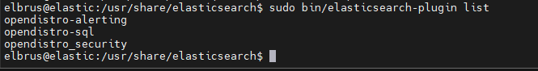

After that, need change `elasticsearch.yml`

```yml
network.host: 127.0.0.1
node.name: node-1
cluster.initial_master_nodes: node-1
xpack.security.enabled: false
opendistro_security.ssl.transport.pemcert_filepath: /etc/elasticsearch/certs/elasticsearch.pem
opendistro_security.ssl.transport.pemkey_filepath: /etc/elasticsearch/certs/elasticsearch-key.pem
opendistro_security.ssl.transport.pemtrustedcas_filepath: /etc/elasticsearch/certs/root-ca.pem
opendistro_security.ssl.transport.enforce_hostname_verification: false
opendistro_security.ssl.transport.resolve_hostname: false
opendistro_security.ssl.http.enabled: true
opendistro_security.ssl.http.pemcert_filepath: /etc/elasticsearch/certs/elasticsearch.pem
opendistro_security.ssl.http.pemkey_filepath: /etc/elasticsearch/certs/elasticsearch-key.pem
opendistro_security.ssl.http.pemtrustedcas_filepath: /etc/elasticsearch/certs/root-ca.pem
opendistro_security.nodes_dn:
- CN=node-1,OU=Docu,O=Wazuh,L=California,C=US
opendistro_security.authcz.admin_dn:
- CN=admin,OU=Docu,O=Wazuh,L=California,C=US

opendistro_security.audit.type: internal_elasticsearch
opendistro_security.enable_snapshot_restore_privilege: true
opendistro_security.check_snapshot_restore_write_privileges: true
opendistro_security.restapi.roles_enabled: ["all_access", "security_rest_api_access"]
node.max_local_storage_nodes: 3
path.data: /var/lib/elasticsearch
path.logs: /var/log/elasticsearch
```

Adding Users and Roles

```sh
$ curl -so /usr/share/elasticsearch/plugins/opendistro_security/securityconfig/roles.yml https://packages.wazuh.com/resources/4.2/open-distro/elasticsearch/roles/roles.yml
$ curl -so /usr/share/elasticsearch/plugins/opendistro_security/securityconfig/roles_mapping.yml https://packages.wazuh.com/resources/4.2/open-distro/elasticsearch/roles/roles_mapping.yml
$ curl -so /usr/share/elasticsearch/plugins/opendistro_security/securityconfig/internal_users.yml https://packages.wazuh.com/resources/4.2/open-distro/elasticsearch/roles/internal_users.yml
```

Generate and deploy the certificates

```sh
$ curl -so ~/wazuh-cert-tool.sh https://packages.wazuh.com/resources/4.2/open-distro/tools/certificate-utility/wazuh-cert-tool.sh
$ curl -so ~/instances.yml https://packages.wazuh.com/resources/4.2/open-distro/tools/certificate-utility/instances_aio.yml

$ bash ~/wazuh-cert-tool.sh

$ mkdir /etc/elasticsearch/certs/
$ chown elasticsearch:elasticsearch -R /etc/elasticsearch/certs/*
$ mv ~/certs/elasticsearch* /etc/elasticsearch/certs/
$ mv ~/certs/admin* /etc/elasticsearch/certs/
$ cp ~/certs/root-ca* /etc/elasticsearch/certs/
```

Removing vulnerabilities Log4j2 Remote Code Execution (RCE) vulnerability - CVE-2021-44228 - ESA-2021-31.

```sh
$ mkdir -p /etc/elasticsearch/jvm.options.d
$ echo '-Dlog4j2.formatMsgNoLookups=true' > /etc/elasticsearch/jvm.options.d/disabledlog4j.options
$ chmod 2750 /etc/elasticsearch/jvm.options.d/disabledlog4j.options
$ chown root:elasticsearch /etc/elasticsearch/jvm.options.d/disabledlog4j.options

$ systemctl daemon-reload
$ systemctl enable elasticsearch
$ systemctl start elasticsearch

$ export JAVA_HOME=/usr/share/elasticsearch/jdk/ && /usr/share/elasticsearch/plugins/opendistro_security/tools/securityadmin.sh -cd /usr/share/elasticsearch/plugins/opendistro_security/securityconfig/ -nhnv -cacert /etc/elasticsearch/certs/root-ca.pem -cert /etc/elasticsearch/certs/admin.pem -key /etc/elasticsearch/certs/admin-key.pem

$ curl -XGET https://localhost:9200 -u admin:<YOUR-PASSWORD> -k
```

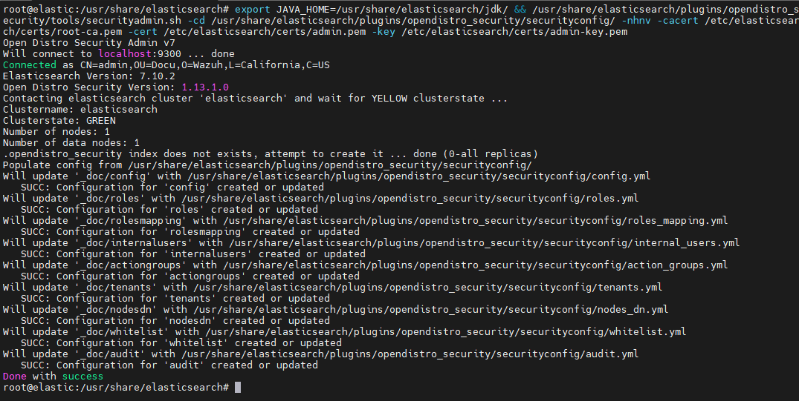
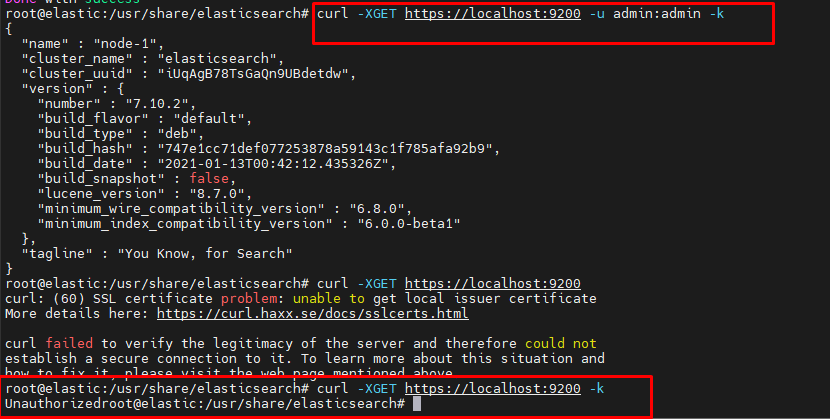

#### Configuring Kibana

Changing configuration file `kibana.yml`

```sh
$ vim /etc/kibana/kibana.yml
```

```yml
server.host: 0.0.0.0
server.port: 443
elasticsearch.hosts: https://localhost:9200
elasticsearch.ssl.verificationMode: certificate
elasticsearch.username: kibanaserver
elasticsearch.password: kibanaserver
opendistro_security.multitenancy.enabled: true
elasticsearch.requestHeadersWhitelist: ["securitytenant","Authorization"]
opendistro_security.readonly_mode.roles: ["kibana_read_only"]
server.ssl.enabled: true
server.ssl.key: "/etc/kibana/certs/kibana-key.pem"
server.ssl.certificate: "/etc/kibana/certs/kibana.pem"
elasticsearch.ssl.certificateAuthorities: ["/etc/kibana/certs/root-ca.pem"]
telemetry.banner: false
xpack.security.enabled: false
xpack.spaces.enabled: false
```

Installing plugins for kibana: Security, Alerting, anomaly detection, index state management, 

```sh
$ mkdir /usr/share/kibana/data
$ chown -R kibana:kibana /usr/share/kibana/data
$ chown -R kibana:kibana /usr/share/kibana/plugins

$ cd /usr/share/kibana
$ sudo -u kibana bin/kibana-plugin install https://d3g5vo6xdbdb9a.cloudfront.net/downloads/kibana-plugins/opendistro-security/opendistroSecurityKibana-1.13.0.1.zip
$ sudo -u kibana bin/kibana-plugin install https://d3g5vo6xdbdb9a.cloudfront.net/downloads/kibana-plugins/opendistro-alerting/opendistroAlertingKibana-1.13.0.0.zip
$ sudo -u kibana bin/kibana-plugin install https://d3g5vo6xdbdb9a.cloudfront.net/downloads/kibana-plugins/opendistro-index-management/opendistroIndexManagementKibana-1.13.0.1.zip
$ sudo -u kibana bin/kibana-plugin install https://d3g5vo6xdbdb9a.cloudfront.net/downloads/kibana-plugins/opendistro-anomaly-detection/opendistroAnomalyDetectionKibana-1.13.0.0.zip
$ sudo -u kibana bin/kibana-plugin list
```

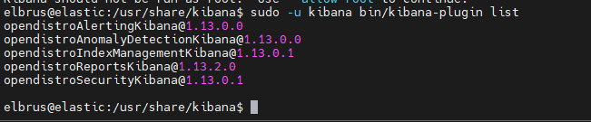

Copy the Elasticsearch certificates

```sh
$ mkdir /etc/kibana/certs
$ cp ~/certs/root-ca.pem /etc/kibana/certs/
$ mv ~/certs/kibana* /etc/kibana/certs/
$ chown kibana:kibana /etc/kibana/certs/*
```

Link Kibana socket to privileged port 443

```sh
$ setcap 'cap_net_bind_service=+ep' /usr/share/kibana/node/bin/node
```

Enable and start the Kibana

```sh
$ systemctl daemon-reload
$ systemctl enable kibana
$ systemctl start kibana
```

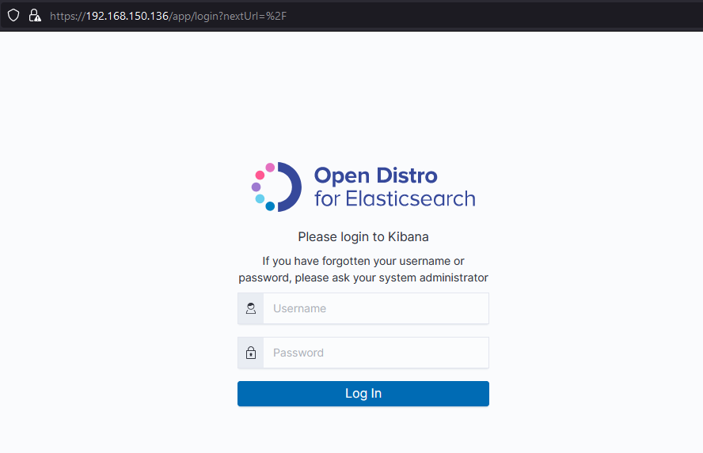

#### Configuring logstash

Create configuration file

```sh
$ sudo cp /etc/logstash/logstash-sample.conf /etc/logstash/conf.d/logstash.conf
```

Change them 

```conf
input {
  beats {
    port => 5044
  }
}

output {
  elasticsearch {
    hosts => ["https://localhost:9200"]
    index => "%{[@metadata][beat]}-%{[@metadata][version]}-%{+YYYY.MM.dd}"
    user => "admin"
    password => "<YOUR-PASSWORD>"
  }
}
```

Enable and start the Kibana

```sh
$ systemctl daemon-reload
$ systemctl enable logstash
$ systemctl start logstash
```

#### Configuring && tuning filebeat

Change configuration file `filebeat.yml` to 

```yml
output.elasticsearch:
  hosts: ["127.0.0.1:9200"]
  protocol: https
  username: "admin"
  password: "<YOUR-PASSWORD>"
  ssl.certificate_authorities:
    - /etc/filebeat/certs/root-ca.pem
  ssl.certificate: "/etc/filebeat/certs/filebeat.pem"
  ssl.key: "/etc/filebeat/certs/filebeat-key.pem"
setup.template.json.enabled: true
setup.template.json.path: '/etc/filebeat/wazuh-template.json'
setup.template.json.name: 'wazuh'
setup.ilm.overwrite: true
setup.ilm.enabled: false

filebeat.modules:
  - module: wazuh
    alerts:
      enabled: true
    archives:
      enabled: false
```

Download the alerts template for Elasticsearch

```sh
$ curl -so /etc/filebeat/wazuh-template.json https://raw.githubusercontent.com/wazuh/wazuh/4.2/extensions/elasticsearch/7.x/wazuh-template.json
$ chmod go+r /etc/filebeat/wazuh-template.json
```

Download the Wazuh module for Filebeat

```sh
$ curl -s https://packages.wazuh.com/4.x/filebeat/wazuh-filebeat-0.1.tar.gz | tar -xvz -C /usr/share/filebeat/module
```

Copy the Elasticsearch certificates into /etc/filebeat/certs

```sh
$ mkdir /etc/filebeat/certs
$ cp ~/certs/root-ca.pem /etc/filebeat/certs/
$ mv ~/certs/filebeat* /etc/filebeat/certs/
```

Enable and start the Filebeat service

```sh
$ systemctl daemon-reload
$ systemctl enable filebeat
$ systemctl start filebeat
```

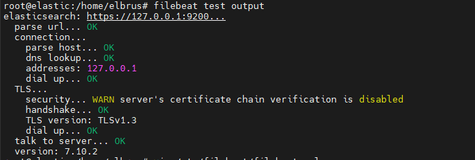

#### Configuring Wazuh manager 

```sh
$ systemctl daemon-reload
$ systemctl enable wazuh-manager
$ systemctl start wazuh-manager
```

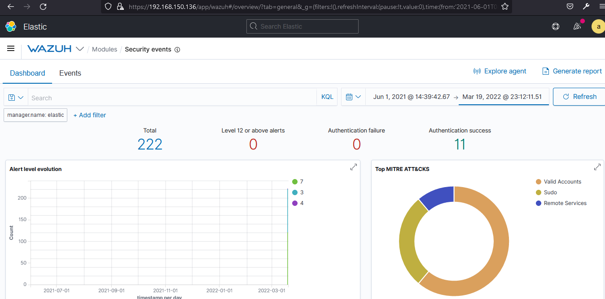
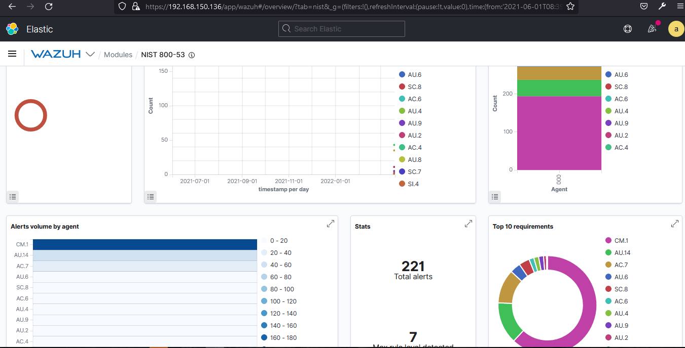

#### Receiving data from containers

Setup logstash for receiving data, adding conf file `docker-01.conf`

```yml
input {
 syslog {
      host => 192.168.150.130
      port => 5000
      type => "docker"
      }
}

filter {
      grok {
            match => { "message" => "%{SYSLOG5424PRI}%{NONNEGINT:ver} +(?:%{TIMESTAMP_ISO8601:ts}|-) +(?:%{HOSTNAME:service}|-) +(?:%{NOTSPACE:containerName}|-) +(?:%{NOTSPACE:proc}|-) +(?:%{WORD:msgid}|-) +(?:%{SYSLOG5424SD:sd}|-|) +%{GREEDYDATA:msg}" }
      }
      syslog_pri { }
      date {
            match => [ "syslog_timestamp", "MMM  d HH:mm:ss", "MMM dd HH:mm:ss" ]
      }
      mutate {
            remove_field => [ "message", "priority", "ts", "severity", "facility", "facility_label", "severity_label", "syslog5424_pri", "proc", "syslog_severity_code", "syslog_facility_code", "syslog_facility", "syslog_severity", "syslog_hostname", "syslog_message", "syslog_timestamp", "ver" ]
      }
      mutate {
            remove_tag => [ "_grokparsefailure_sysloginput" ]
      }
      mutate {
            gsub => [
                  "service", "[0123456789-]", ""
            ]
      }
      if [msg] =~ "^ *{" {
            json {
                  source => "msg"
            }
            if "_jsonparsefailure" in [tags] {
                  drop {}
            }
            mutate {
                  remove_field => [ "msg" ]
            }
      }
}

output {
 elasticsearch {
      hosts => "elasticsearch:9200"
      user => admin
      password => <YOUR-PASSWORD>
      ssl_certificate_verification => false
      }
}
```

Go to the new VM and run command:

```sh
docker run --log-driver=syslog --log-opt syslog-address=tcp://:5000 --log-opt syslog-facility=daemon -p 4080:4080 -d -v /var/run/docker.sock:/var/run/docker.sock -v apache-web-server
```

```sh
input { 
  file { 
    path => "/home/elbrus/apache-daily-access.log" 
    start_position => "beginning" 
    sincedb_path => "/dev/null" 
    } 
  } 
filter { 
  grok { 
    match => { 
      "message" => "%{COMBINEDAPACHELOG}" 
    } 
  } 
  date { 
    match => [ "timestamp" , "dd/MMM/yyyy:HH:mm:ss Z" ] 
  } 
  geoip { 
    source => "clientip" 
  } 
} 
output { 
  elasticsearch { 
    hosts => ["https://localhost:9200"] 
    user => admin
    password => <YOUR-PASSWORD>
    ssl_certificate_verification => false
    } 
}
```

#### Getting Data from sources

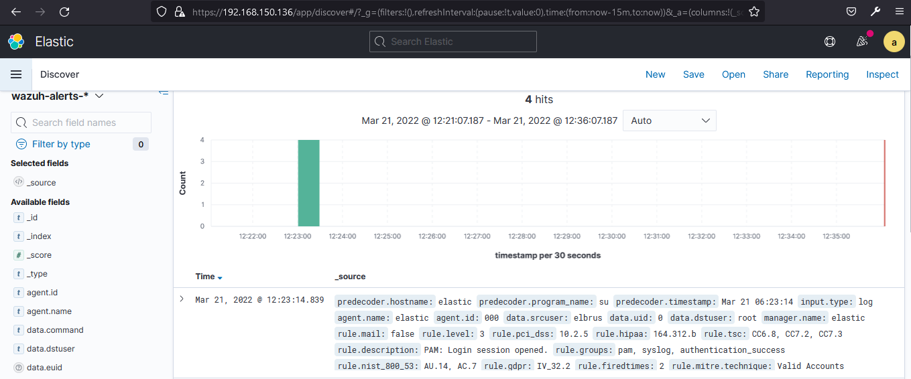
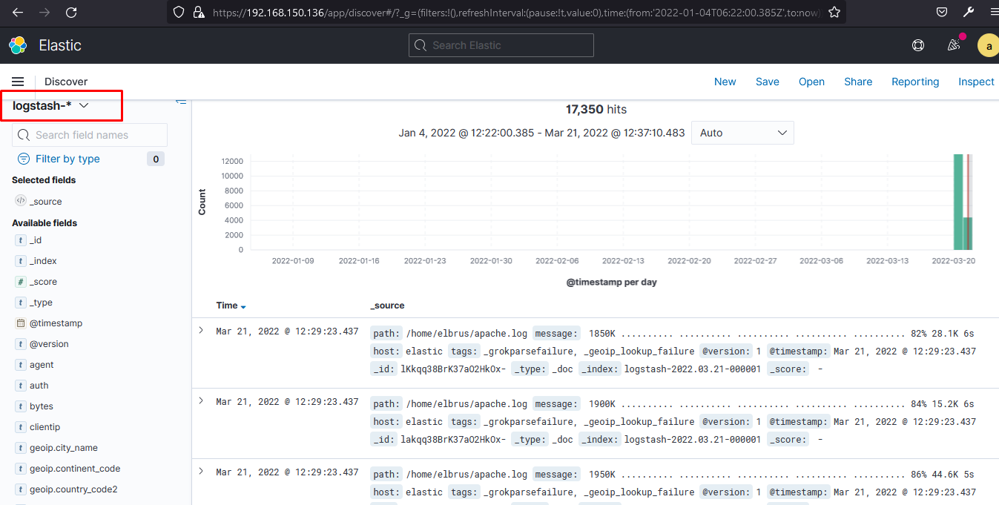

#### Dashboard 

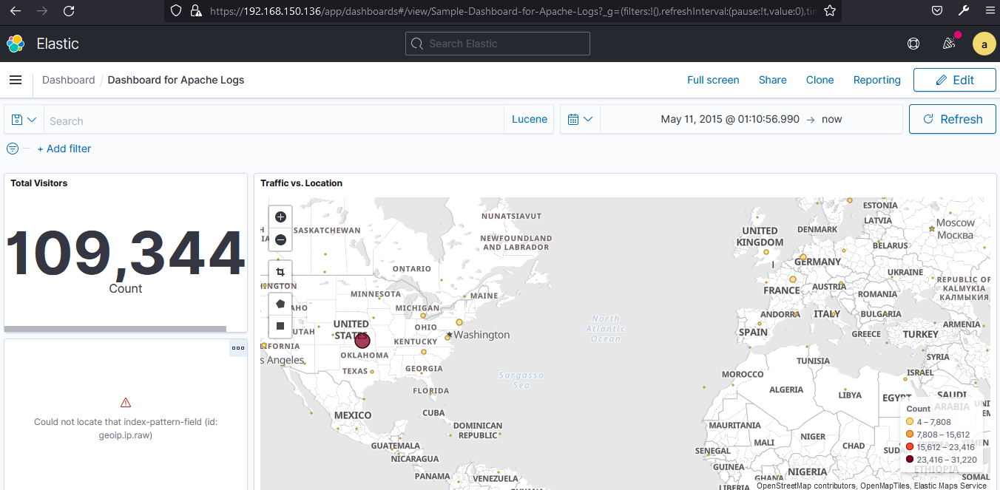
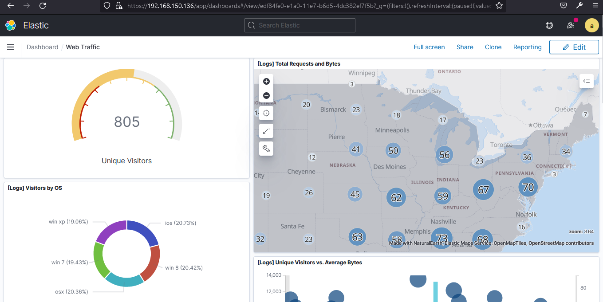

