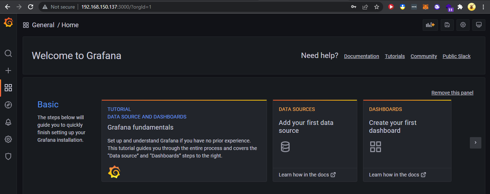
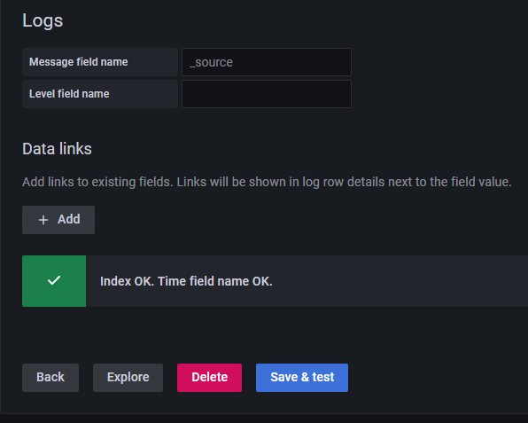
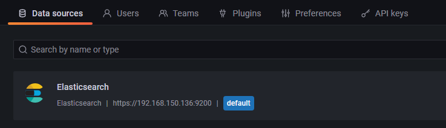
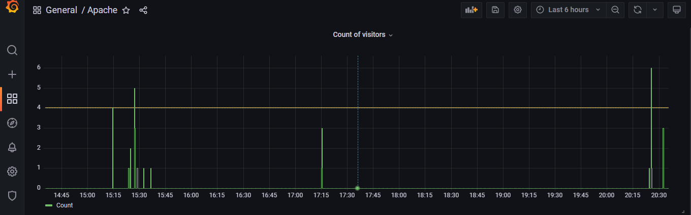

# Exadel DevOps Internship 🤘

---

## Grafana 

1. Install Grafana
2. Integrate with installed ELK
3. Set up Dashboards
4. Study features and settings

### Installing 

Commands bellow from official docs

```sh
sudo apt-get install -y adduser libfontconfig1
wget https://dl.grafana.com/oss/release/grafana_8.4.4_amd64.deb
sudo dpkg -i grafana_8.4.4_amd64.deb
```



### Integration with ELK 

Setup Data sources 


 

### Dashboard

```
NOTE:
Cause by low performance in my virtual lab I cannot run two VMs with ELK & Grafana severs.
And low logstash and elasticsearch performance there are a lot of timeout problems. 
I've built everything I've been able to build below. 
```



