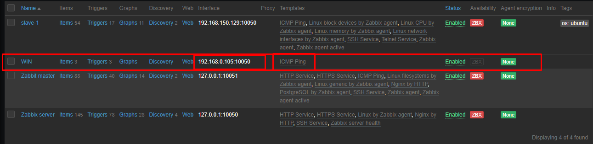
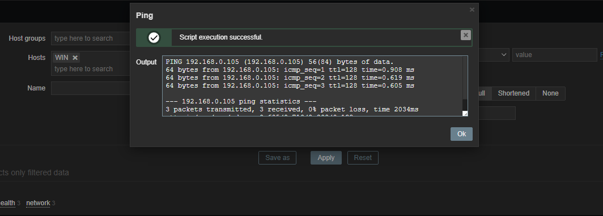
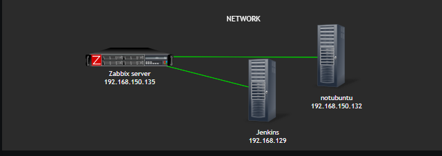

# Exadel DevOps Internship 🤘

---

## Zabbix

1. Install on server, configure web and base
2. Prepare VM or instances. 
3. Install Zabbix agents on previously prepared servers or VM.
4. Make several of your own dashboards, where to output data from your host/vm/container (one of them)
5. Active check vs passive check - use both types.
6. Make an agentless check of any resource (ICMP ping)
7. Provoke an alert - and create a Maintenance instruction
8. Set up a dashboard with infrastructure nodes and monitoring of hosts and software installed on them

### Steps

#### Zabbix Master Server

```sh
$ wget https://repo.zabbix.com/zabbix/6.0/ubuntu/pool/main/z/zabbix-release/zabbix-release_6.0-1+ubuntu20.04_all.deb

$ dpkg -i zabbix-release_6.0-1+ubuntu20.04_all.deb

$ apt update

$ apt install zabbix-server-pgsql zabbix-frontend-php php7.4-pgsql zabbix-nginx-conf zabbix-sql-scripts zabbix-agent postgresql postgresql-contrib

$ sudo -u postgres createuser --pwprompt zabbix
$ sudo -u postgres createdb -O zabbix zabbix

$ zcat /usr/share/doc/zabbix-sql-scripts/postgresql/server.sql.gz | sudo -u zabbix psql zabbix

# Edit nginx/conf.d/zabbix.conf file
# Uncomment lines 

listen 80;
server_name zabbix;

# Edit nginx/nginx.conf
# Comment line 

# include /etc/nginx/sites-enabled/*;

$ sudo /etc/init.d/nginx reload
$ sudo systemctl restart zabbix-server zabbix-agent nginx php7.4-fpm postgresql 
```


#### Zabbix Agent

```sh
$ wget https://repo.zabbix.com/zabbix/6.0/ubuntu/pool/main/z/zabbix-release/zabbix-release_6.0-1+ubuntu20.04_all.deb
$ dpkg -i zabbix-release_6.0-1+ubuntu20.04_all.deb
$ apt update

$ apt install zabbix-agent

$ sudo sh -c "openssl rand -hex 32 > /etc/zabbix/zabbix_agentd.psk"

# Show the key 
$ cat /etc/zabbix/zabbix_agentd.psk
Output
a4374c8c3b55de472225dbf96aa7cd3ce6a34abc95d0eb2a601d954ee0cd4410

# Edit the Zabbix agent settings
$ sudo vi /etc/zabbix/zabbix_agentd.conf

Server=192.168.150.129
TLSConnect=psk
TLSAccept=psk
TLSPSKIdentity=PSK 001
TLSPSKFile=/etc/zabbix/zabbix_agentd.psk


# Restart service 
$ sudo systemctl start zabbix-agent
$ sudo systemctl enable zabbix-agent
```

#### Dashboards


#### Active & Passive checks 

Setup configuration file of agent to enable active & passive mode

```sh
# For Active the port is 10051 !!!
ServerActive=192.168.150.135
# For Passive the port is 10050 !!!
Server=192.168.150.135
HostnameItem=system.hostname
HostMetadata=release
```

#### Agentless ICMP pings 

Install `fping` then configuring `zabbix_server.conf`

```
FpingLocation=/usr/bin/fping
Fping6Location=/usr/bin/fping6
```

Go to Web panel --> Configuration --> Hosts, add new host with ICMP Ping template





#### Alert

```
NOTE: 
I was unable to trigger the alert and could not determine the reason. 
Probably I think it's cause low performance due to limitations in the local virtual lab. 
```

#### Building internal network map 

My internal virtual lab was like this:

